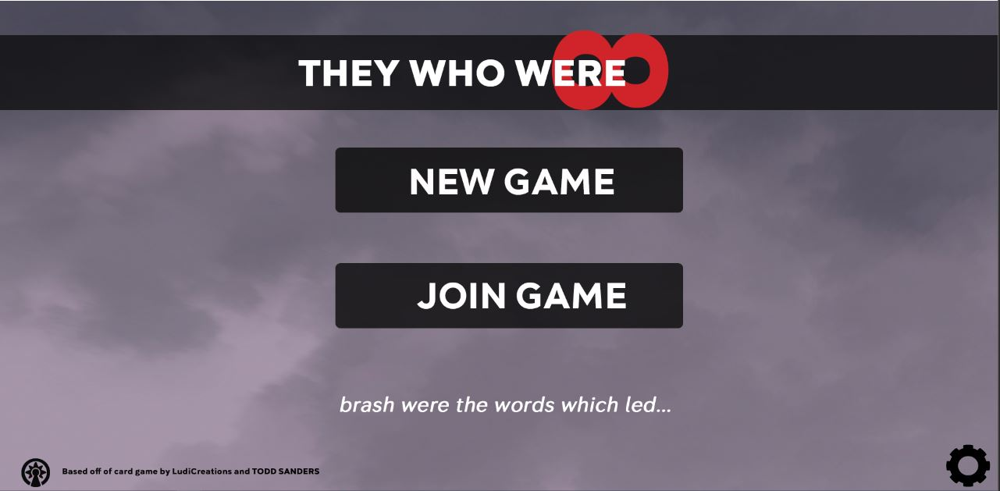

# THEYWHOWERE8
A web-adapted version of the card game, They Who Were 8, created using Javascript. Future goals include online multiplayer and 2 and 4 person support.

## About

They Who Were 8 is a 2-4  person card game in which each player controls two gods, competing to praise their gods with glory, and avoid receiving infamy from other players.

## Development

Open the mainMenu.html file
